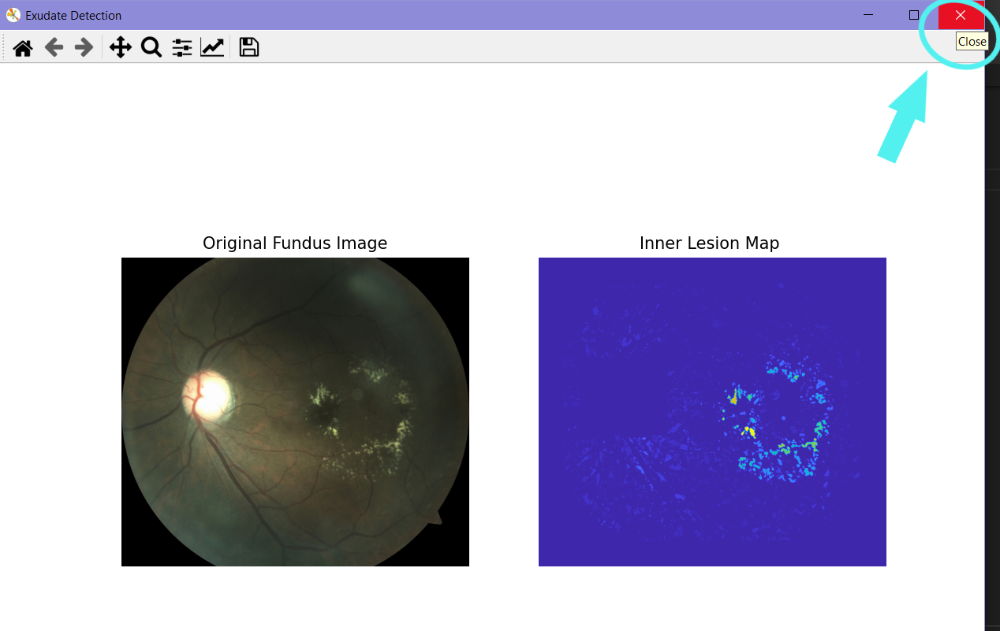
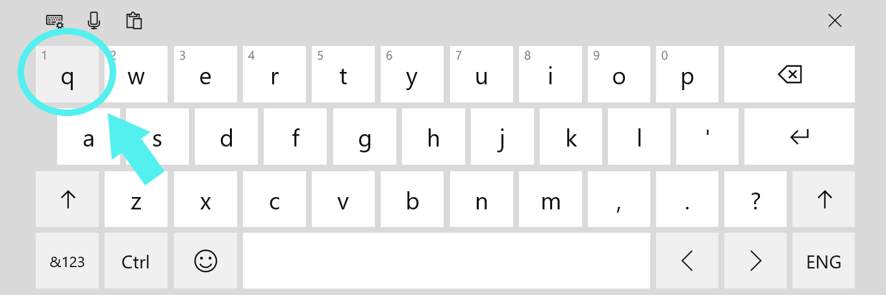

# About The Project


Using The Hamilton Eye Institute Macular Edema Dataset (HEI-MED). We aim to detect exudates -type of bright lesions- in fundus images, through applying lesion segmentation and color analysis. 

### Here's why:
* Diabetic macular edema (DME) is a complication of Diabetic retinopathy (DR).
* It is a vision threatenining condition for diabetes patients.
* Early Diagnosis can prevent complete vision loss by providing early treatment.

### Built With

* [Python](https://www.python.org/)
* [Matplotlib](https://matplotlib.org/)
* [OpenCV](https://opencv.org/)
* [scikit-image](https://scikit-image.org/)
* [NumPy](https://numpy.org/)
* [SciPy](https://scipy.org/)  


&nbsp;

## Getting Started

### Prerequisites

You need to install these libraries:
* pip
  ```bash
  pip install matplotlib
  pip install opencv-python
  pip install scikit-image
  pip install numpy
  pip install scipy
  pip install keyboard
  ```

### Installation

1. Clone the repo
   ```bash
   git clone https://github.com/samarnabil/Exudate-Detection.git
   ```
3. Install pip packages - mentioned in the above prerequisite section.

&nbsp;
## Usage

1. Open the project with your editor of choice.
2. Run [tesy.py](test.py)
3. Wait for the figure window.
4. Press 'close' key to proceed to next image.
    
5. To quit the program, press 'q' key from keyboard.
    

&nbsp;
## The following methods are available

  ### [DMED object oreinted class for handling dataset](misc/Dmed.py)
  1. getNumOfImgs
  ```python
  def getNumOfImgs (self):
      """
      Get number of images in the dataset
      _________
      Returns: 
          number of images
        """
  ```
  2. getImg
  ```python
    def getImg (self,imgID): 
      """
      Get image with the given imgID.
      _________
      Arguments:
          id: dictionary key for accessing its photo
      Returns: 
          Fundus image
      """
  ```
  3. getONloc
  ```python
  def getONloc(self, id):
      """
      Get the hand identified location of the optic nerve
      _________
      Arguments:
          id: dictionary key for accessing its photo
      Returns: 
          onRow: X coordinate of optical nerve
          onCol: Y coordinate of optical nerve
      """
  ```
  &nbsp;
  ### [exDetect File](exDetect.py)
  1. exDetect
  ```python
  def exDetect( rgbImgOrig, removeON, onY, onX ):
      """
      Reads optical nerve location for meta file
      _________
      Arguments:
          rgbImgOrig: Fundus Image
          removeON: an integer, acts as flag for removing optical nerve location
          onY: horizontal coordinate of optical nerve - row
          onX: vertical coordinate of optical nerve - col
      Returns: 
          imgProb:  Inner Lesion Map 
      """
  ```
  2. getLesions
  ```python
  def getLesions( rgbImgOrig, showRes, removeON, onY, onX ):
      """
      1.Resize the original fundus image
      2.Extract the green channel image
      3.Find field of view mask from the image's HSI colour space
      4.Estimate the background with a large median filter
      5.Perform a morphological reconstruction of an image by dilation
      6.Capture the external edges of the lesion candidates by Kirsch’s Edges
      _________
      Arguments:
          rgbImgOrig: Fundus Image
          showRes: A flag set to zero 
          removeON: an integer, acts as flag for removing optical nerve location
          onY: horizontal coordinate of optical nerve - row
          onX: vertical coordinate of optical nerve - col
      Returns: 
          lesCandImg:  Inner Lesion Map
      """
  ```
  3. findGoodResolutionForWavelet
  ```python
  def findGoodResolutionForWavelet(sizeIn):
    """
    calculate new size of image to resize the image to a height of 752 pixels maintaining the original height/width ratio
    _________
    Arguments:
        sizeIn: Fundus Image size
    Returns: 
        sizeOut: new size
    """
  ```
  4. show_results
  ```python
  def show_results(org_img, seg_img):
    """
    Show original image beside its segmented exudates
    _________
    Arguments:
        org_img: Original fundus Image
        seg_img: Segmented exudates
  """
  ```
  5. colormap_data
  ```python
  def colormap_data():
      """
      Create colormap
      _________

      Returns: 
          parula_map: Linear segmented colormap
      """
  ```
  &nbsp;
  ### [getFovMask File](misc/getFovMask.py)
  1. getFovMask
  ```python
  def getFovMask(gImg, erodeFlag, seSize):
    """
    Get a binary image of the Field of View mask to remove background
    _________
    Arguments:
        gImg: Image representing intensity channel from HSV color space
        erodeFlag: an integer, acts as flag for applying erosion on image or not - (0,1)
        seSize: structural element radius
    Returns: 
        Field of view mask
    """
  ```

  ### [KirschEdges File](misc/kirschEdges.py)
  1. KirschEdges
  ```python
  def kirschEdges(imgIn):
    """
    Calculate the edge map using Spatial Filtering by Kirsch's Templates
    _________
    Arguments:
        imgIn: green chanel of input image 
    Returns: 
        imgOut: edge map which contains maximum edges value -->
  ```


&nbsp;
## Contact

* Samar Nabil - samarnabil22@gmail.com 
* Yomna Sabah - 
* Menna Kamel

Project Link: [https://github.com/samarnabil/Exudate-Detection](https://github.com/samarnabil/Exudate-Detection)


&nbsp;
## Acknowledgments

* [Giancardo, L.; Meriaudeau, F.; Karnowski, T. P.; Li, Y.; Garg, S.; Tobin, Jr, K. W.; Chaum, E. (2012), 'Exudate-based diabetic macular edema detection in fundus images using publicly available datasets.', Medical Image Analysis 16(1), 216--226.](https://www.sciencedirect.com/science/article/abs/pii/S1361841511001010?via%3Dihub)

